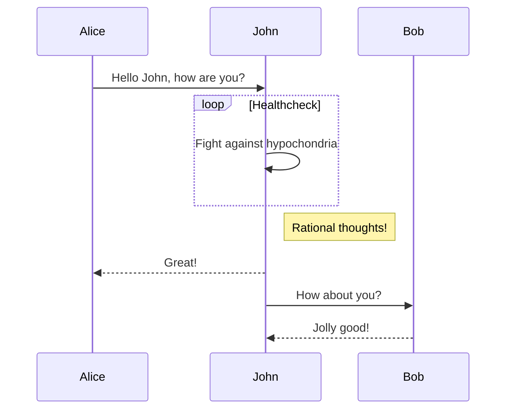
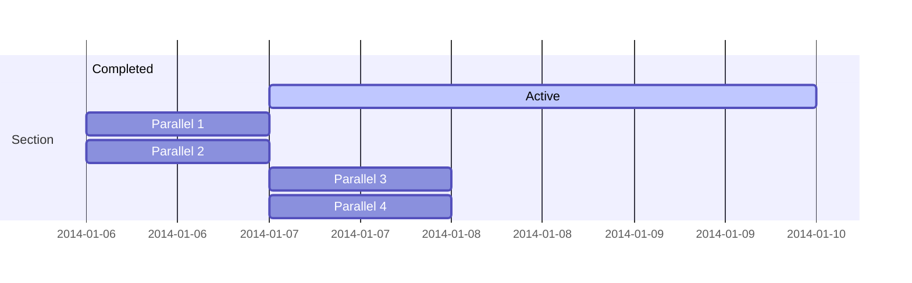
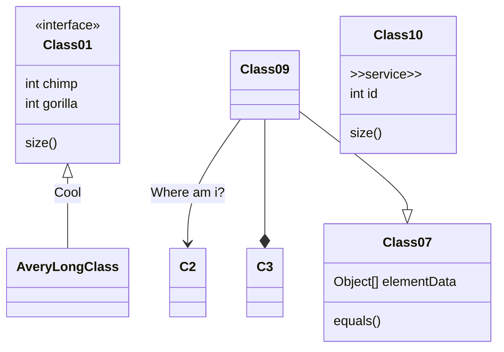
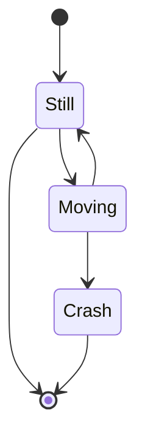
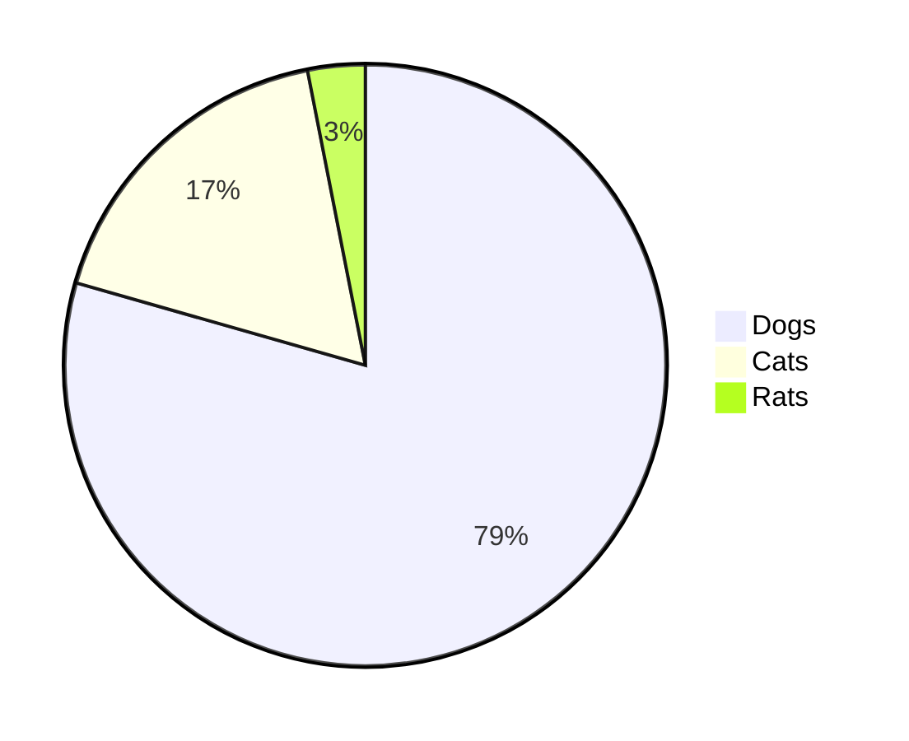
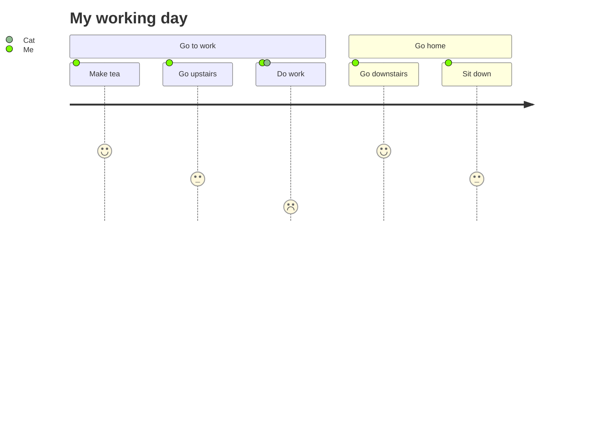

# mermaid

Testing mermaid diagrams.

## How to show these diagram in Github

Unfortunately, Github does not support mermaid rendering natively. There is a [Chrome extension](https://github.com/BackMarket/github-mermaid-extension) by [Alex Mercier](https://github.com/amercier)

Check the discussion [here](https://stackoverflow.com/questions/50762662/how-to-install-mermaid-to-render-flowcharts-in-markdown)

Another solution in moving your repository to gitlab. It natively supports mermaid in all markdown files.

## Examples

### Flow


### Sequence




### Gantt



At leas in my case, all the diagrams from this one fail at rendering using the extensions. 

### Class




### State




### Pie




### User Journey



## Using SVG

 Here we show in a standard format (SVG) without having to install any extensions. But we will have to create a process that automatically creates the images from the text.

## Test Mermaid version

```mermaid
  info
```

## Test geojson


```geojson
{
  "type": "FeatureCollection",
  "features": [
    {
      "type": "Feature",
      "id": 1,
      "properties": {
        "ID": 0
      },
      "geometry": {
        "type": "Polygon",
        "coordinates": [
          [
              [-90,35],
              [-90,30],
              [-85,30],
              [-85,35],
              [-90,35]
          ]
        ]
      }
    }
  ]
}

## Test Topojson

```topojson
{
  "type": "Topology",
  "transform": {
    "scale": [0.0005000500050005, 0.00010001000100010001],
    "translate": [100, 0]
  },
  "objects": {
    "example": {
      "type": "GeometryCollection",
      "geometries": [
        {
          "type": "Point",
          "properties": {"prop0": "value0"},
          "coordinates": [4000, 5000]
        },
        {
          "type": "LineString",
          "properties": {"prop0": "value0", "prop1": 0},
          "arcs": [0]
        },
        {
          "type": "Polygon",
          "properties": {"prop0": "value0",
            "prop1": {"this": "that"}
          },
          "arcs": [[1]]
        }
      ]
    }
  },
  "arcs": [[[4000, 0], [1999, 9999], [2000, -9999], [2000, 9999]],[[0, 0], [0, 9999], [2000, 0], [0, -9999], [-2000, 0]]]
}
```

## Create STL 3D Modeling

```stl
solid cube_corner
  facet normal 0.0 -1.0 0.0
    outer loop
      vertex 0.0 0.0 0.0
      vertex 1.0 0.0 0.0
      vertex 0.0 0.0 1.0
    endloop
  endfacet
  facet normal 0.0 0.0 -1.0
    outer loop
      vertex 0.0 0.0 0.0
      vertex 0.0 1.0 0.0
      vertex 1.0 0.0 0.0
    endloop
  endfacet
  facet normal -1.0 0.0 0.0
    outer loop
      vertex 0.0 0.0 0.0
      vertex 0.0 0.0 1.0
      vertex 0.0 1.0 0.0
    endloop
  endfacet
  facet normal 0.577 0.577 0.577
    outer loop
      vertex 1.0 0.0 0.0
      vertex 0.0 1.0 0.0
      vertex 0.0 0.0 1.0
    endloop
  endfacet
endsolid
```

