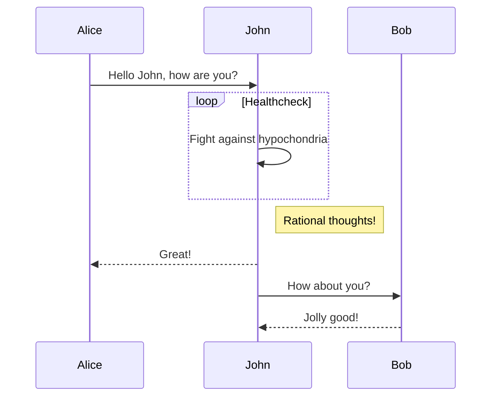
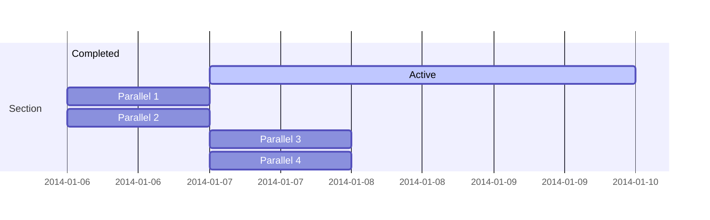
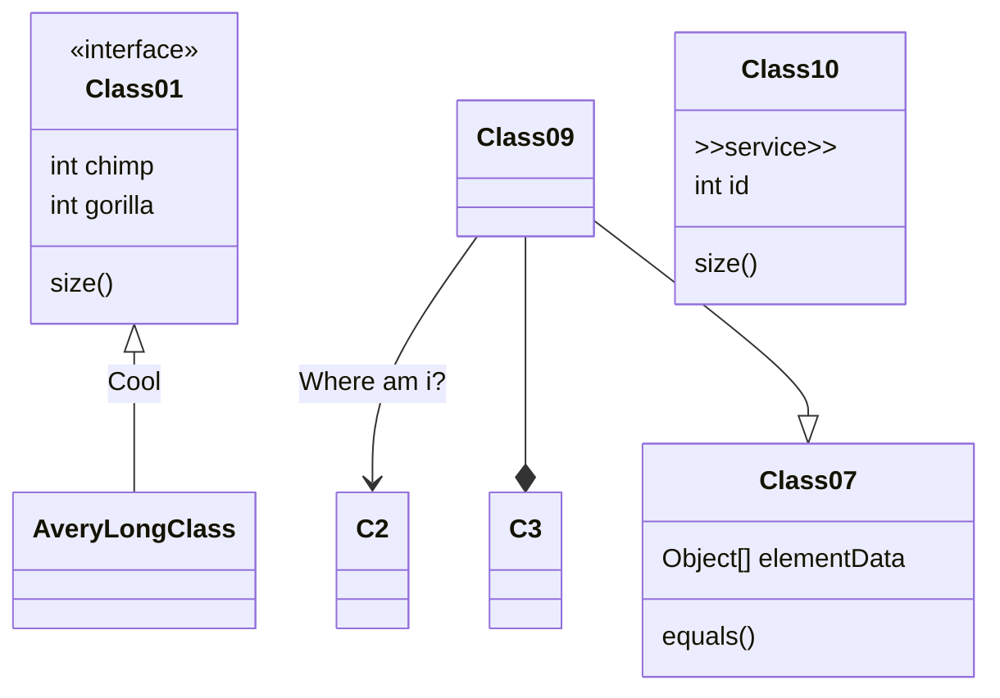
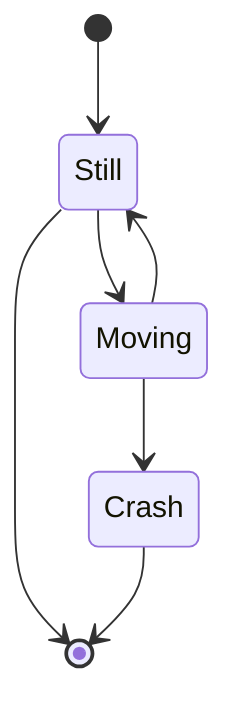
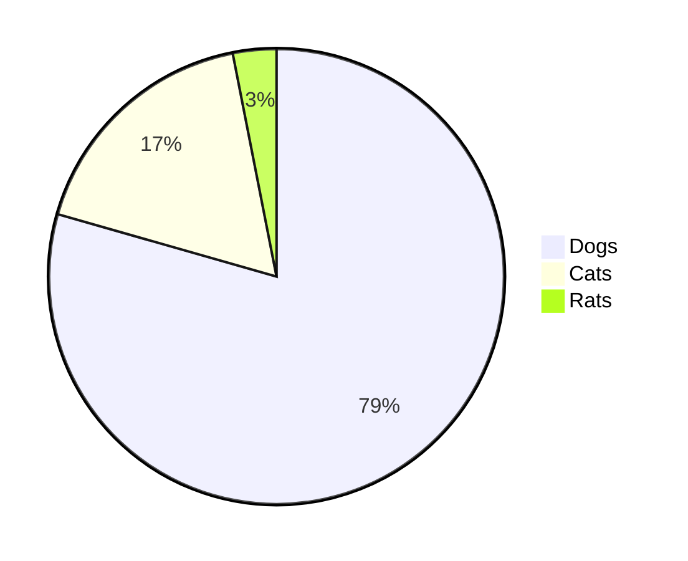
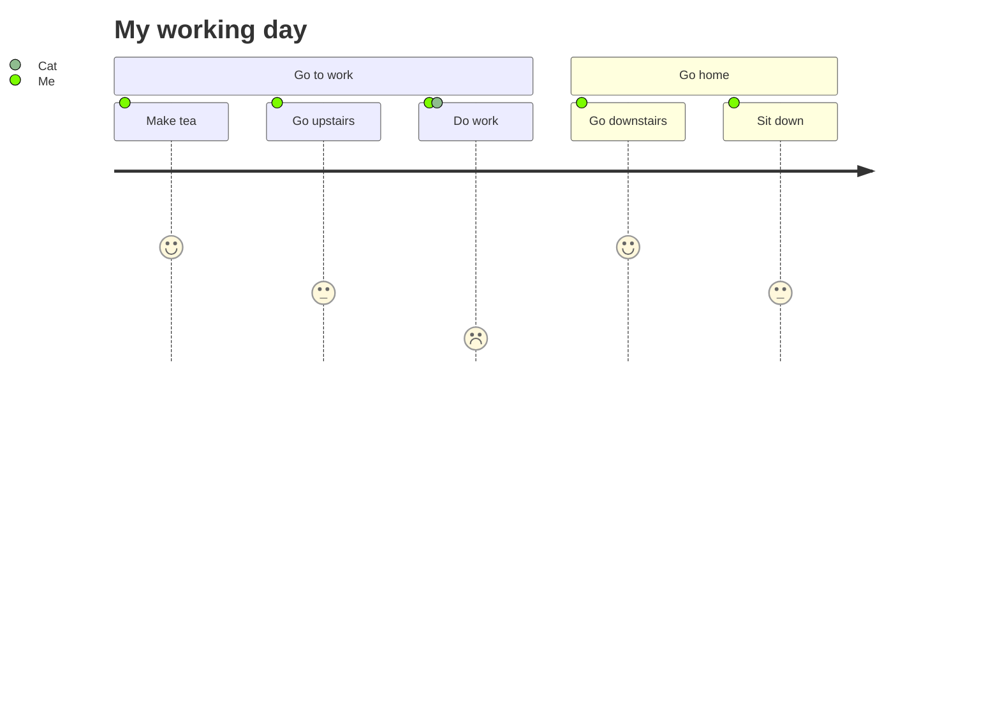

# mermaid

Testing mermaid diagrams.

## How to show these diagram in Github

Unfortunately, Github does not support mermaid rendering natively. There is a [Chrome extension](https://github.com/BackMarket/github-mermaid-extension) by [Alex Mercier](https://github.com/amercier)

Check the discussion [here](https://stackoverflow.com/questions/50762662/how-to-install-mermaid-to-render-flowcharts-in-markdown)

Another solution in moving your repository to gitlab. It natively supports mermaid in all markdown files.

## Examples

### Flow

### Sequence

### Gantt

At leas in my case, all the diagrams from this one fail at rendering using the extensions. 

### Class

### State

### Pie

### User Journey

## Using SVG

 Here we show in a standard format (SVG) without having to install any extensions. But we will have to create a process that automatically creates the images from the text.
